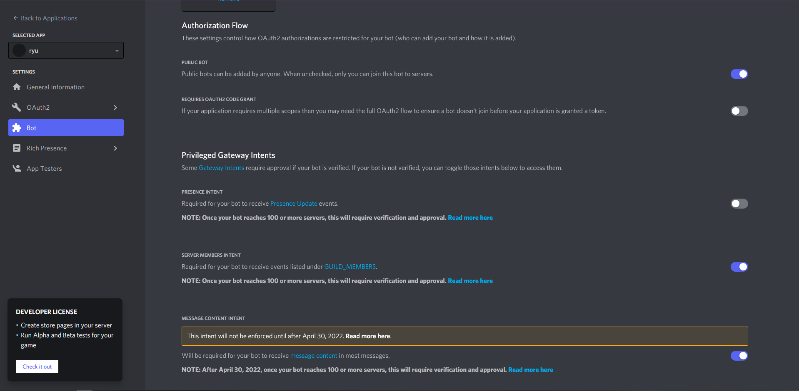

# Ryu Discord Bot

Ryu is a discord bot made with python.

## Features 
- Admin commands (ban, unban, kick, create and delete channel, reset level)
- Economy commands (get a job, work, balance, deposit and withdraw)
- User Leveling (gain levels, check level)
- Misc (show avatar, random quote, ping)


## Set up bot token
Follow the steps in this article to set up the bot, attain the token and have invite the bot to your discord server. https://www.writebots.com/discord-bot-token/

Make sure to enable intents 



Make a .env file 
```
touch .env
```

Open .env file and add the following
```
TOKEN=yourtokenhere
```

## Install necessary packages

Recommended to use python 3.9

Use the package manager [pip](https://pip.pypa.io/en/stable/) to install discord.py, python-dotenv and aiosqlite.

```bash
pip3 install discord.py
pip3 install aiosqlite
pip3 install python-dotenv
```

## To run the bot

```bash
python3 main.py
```

## License
[MIT](https://choosealicense.com/licenses/mit/)